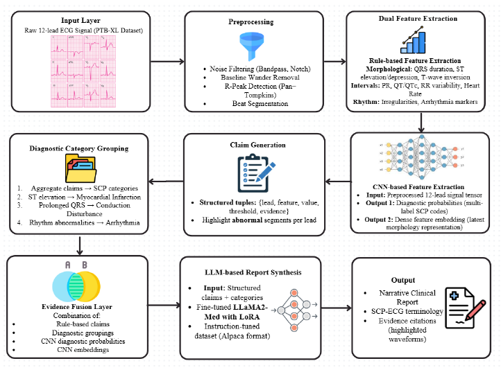

---

##### Download

+ [Paper](CLAIMS_Paper.pdf)
+ [Code](https://github.com/YOUR_GITHUB_REPO)
+ [Data](https://www.kaggle.com/datasets/khyeh0719/ptb-xl-dataset/data)

---

##### Abstract

ECG interpretation is vital in clinical cardiology for detecting cardiovascular conditions, yet manual waveform analysis is labor-intensive and prone to error. This paper introduces **CLAIMS**, an automated multi-lead ECG interpretation pipeline that integrates Convolutional Neural Networks (CNNs) and Large Language Models (LLMs) for accurate and explainable classification. The system extracts waveform-level features across all 12 leads, forms structured evidence-based claims, and generates clinical reports using an LLM fine-tuned for medical reasoning. Claims include explicit timestamp citations from raw ECG signals, improving interpretability and trust. Experiments on the PTB-XL dataset demonstrate that CLAIMS produces clinically meaningful, evidence-backed diagnostic narratives while achieving competitive performance in identifying key cardiac abnormalities.

---

##### Figure 1: System Architecture (placeholder)



---

##### Citation

Varathakumaran, A., Jawahar, A., Pandiyaraju, V., & Senthil Kumar, A. M. (2025). *CLAIMS: Clinical Labeling and Abnormality Inference from Multilead ECG using LLMs with Evidence Citation.* IEEE Conference Publication.

```latex
@inproceedings{Varathakumaran2025CLAIMS,
  author    = {Aswinkumar Varathakumaran and Akshita Jawahar and Pandiyaraju V and Senthil Kumar A M},
  title     = {CLAIMS: Clinical Labeling and Abnormality Inference from Multilead {ECG} using {LLMs} with Evidence Citation},
  booktitle = {IEEE Conference Proceedings},
  year      = {2025},
  url       = {https://YOUR_LINK_HERE}
}