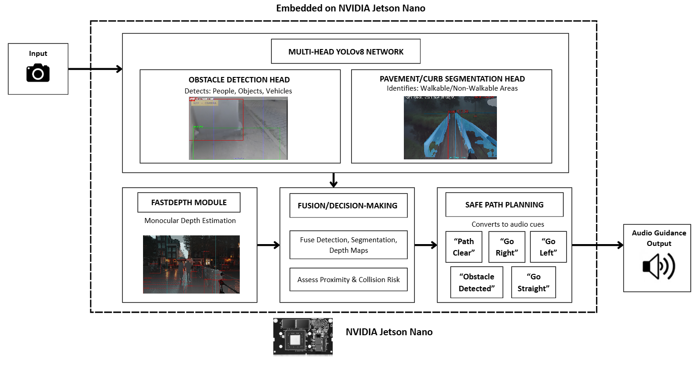

---

##### Download

+ [Paper](Procedia_Paper_Proxi_NAV.pdf)
+ [Code](https://github.com/YOUR_GITHUB_REPO)
+ [Data](https://github.com/kxzr/WOTR)

---

##### Abstract

The visually impaired face severe mobility challenges due to reduced spatial awareness and limited real-time environmental understanding. Traditional aids such as white canes or guide dogs provide only local, static information and do not convey dynamic obstacle movement or path structure. This paper introduces PROXI-NAV, an embedded navigation assistance system that leverages a multi-head YOLOv8 architecture with monocular depth estimation to provide continuous auditory guidance. The system runs on an NVIDIA Jetson Nano, performing obstacle detection, pavement segmentation, and lightweight depth estimation in real time. Audio cues are generated from spatial reasoning over detected obstacles and depth maps, enabling safe, adaptive navigation through cluttered environments. Experimental evaluations demonstrate the system's ability to generate low-latency, context-aware navigation instructions, outperforming traditional sequential pipelines by reducing latency and improving user situational awareness.

---

##### Figure 1: System Architecture (placeholder)



---

##### Citation

Varathakumaran, A., Jawahar, A., Mynampati, S., Sajidha, S. A., & Thaseen, S. (2025). *PROXI-NAV: Proximity-Aware Navigation with Audio-Visual Sensing Intelligence*. Procedia Computer Science, FTNCT08.

```latex
@inproceedings{Varathakumaran2025ProxiNav,
  author    = {Aswinkumar Varathakumaran and Akshita Jawahar and Sreya Mynampati and Sajidha S A and Sumaiya Thaseen},
  title     = {PROXI{-}NAV: Proximity{-}Aware Navigation with Audio{-}Visual Sensing Intelligence},
  booktitle = {Procedia Computer Science, FTNCT08},
  year      = {2025},
  url       = {https://YOUR_LINK_HERE}
}